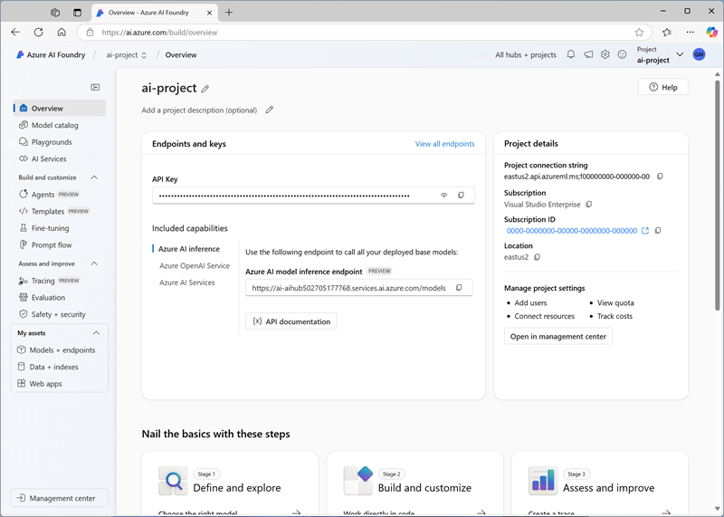

---
lab:
  title: Desenvolver um aplicativo de chat habilitado para áudio
  description: Saiba como usar a Fábrica de IA do Azure para criar um aplicativo de IA generativa que aceite entradas de áudio.
---

# Desenvolver um aplicativo de chat habilitado para áudio

Neste exercício, você usará o modelo de IA generativa *Phi-4-multimodal-instruct* para gerar respostas para prompts que incluem arquivos de áudio. Você desenvolverá um aplicativo que fornece assistência de IA para uma empresa fornecedora de produtos usando a Fábrica de IA do Azure e o SDK do OpenAI para Python para resumir as mensagens de voz deixadas pelos clientes.

Embora este exercício seja baseado em Python, você pode desenvolver aplicativos semelhantes usando vários SDKs específicos da linguagem, incluindo:

- [Projetos de IA do Azure para Python](https://pypi.org/project/azure-ai-projects)
- [Biblioteca OpenAI para Python](https://pypi.org/project/openai/)
- [Projetos de IA do Azure para Microsoft .NET](https://www.nuget.org/packages/Azure.AI.Projects)
- [Biblioteca de clientes do Azure OpenAI para Microsoft .NET](https://www.nuget.org/packages/Azure.AI.OpenAI)
- [Projetos de IA do Azure para JavaScript](https://www.npmjs.com/package/@azure/ai-projects)
- [Biblioteca do OpenAI do Azure para TypeScript](https://www.npmjs.com/package/@azure/openai)

Este exercício levará aproximadamente **30** minutos.

## Criar um projeto da Fábrica de IA do Azure

Vamos começar implantando um modelo em um projeto da Fábrica de IA do Azure.

1. Em um navegador da Web, abra o [Portal da Fábrica de IA do Azure](https://ai.azure.com) em `https://ai.azure.com` e entre usando suas credenciais do Azure. Feche todas as dicas ou painéis de início rápido abertos na primeira vez que você entrar e, se necessário, use o logotipo da **Fábrica de IA do Azure** no canto superior esquerdo para navegar até a home page, que é semelhante à imagem a seguir:

    

1. Na home page, na seção **Explorar modelos e recursos**, pesquise pelo modelo `Phi-4-multimodal-instruct`, que usaremos em nosso projeto.
1. Nos resultados da pesquisa, selecione o modelo **Phi-4-multimodal-instruct** para ver os detalhes e, na parte superior da página do modelo, clique em **Usar este modelo**.
1. Quando solicitado a criar um projeto, insira um nome válido para o projeto e expanda **Opções avançadas**.
1. Selecione **Personalizar** e especifique as seguintes configurações para o hub:
    - **Recurso da Fábrica de IA do Azure**: *um nome válido para o recurso da Fábrica de IA do Azure*
    - **Assinatura**: *sua assinatura do Azure*
    - **Grupo de recursos**: *criar ou selecionar um grupo de recursos*
    - **Região**: *selecione qualquer **AI Foundry recomendado***\*

    > \* Alguns recursos da IA do Azure são restritos por cotas de modelo regional. Caso um limite de cota seja excedido posteriormente no exercício, é possível que você precise criar outro recurso em uma região diferente. Você pode verificar a disponibilidade regional mais recente para modelos específicos na [documentação da Fábrica de IA do Azure](https://learn.microsoft.com/azure/ai-foundry/how-to/deploy-models-serverless-availability#region-availability)

1. Clique em **Criar** e aguarde a criação do projeto.

    Pode levar alguns instantes para que a operação seja concluída.

1. Selecione **Concordar e Continuar** para aceitar os termos do modelo e, em seguida, selecione **Implantar** para concluir a implantação do modelo Phi.

1. Quando o projeto for criado, os detalhes do modelo serão abertos automaticamente. Observe o nome da implantação do modelo, que deve ser **Phi-4-multimodal-instruct**

1. No painel de navegação à esquerda, selecione **Visão geral** para ver a página principal do projeto, que será assim:

    > **Observação**: se um erro de *permissões insuficientes** for exibido, use o botão **Corrigir** para resolvê-lo.

    

## Criar um aplicativo cliente

Agora que você implantou um modelo, pode usar o SDK da Fábrica de IA do Azure para desenvolver um aplicativo que se comunique com ele.

> **Dica**: você pode optar por desenvolver sua solução usando Python ou Microsoft C#. Siga as instruções na seção apropriada para o idioma escolhido.

### Preparar a configuração de aplicativo

1. No Portal da Fábrica de IA do Azure, visualize a página **Visão geral** do seu projeto.
1. Na área **Detalhes do projeto**, observe o **ponto de extremidade do projeto da Fábrica de IA do Azure**. Você usará esse ponto de extremidade para se conectar ao projeto em um aplicativo cliente.
1. Abra uma nova guia do navegador (mantendo o portal da Fábrica de IA do Azure aberto na guia existente). Em seguida, na nova guia, navegue até o [portal do Azure](https://portal.azure.com) em `https://portal.azure.com`; efetue login com suas credenciais do Azure, se solicitado.

    Feche todas as notificações de boas-vindas para ver a home page do portal do Azure.

1. Use o botão **[\>_]** à direita da barra de pesquisa na parte superior da página para criar um Cloud Shell no portal do Azure selecionando um ambiente do ***PowerShell*** sem armazenamento em sua assinatura.

    O Cloud Shell fornece uma interface de linha de comando em um painel na parte inferior do portal do Azure. Você pode redimensionar ou maximizar esse painel para facilitar o trabalho.

    > **Observação**: se você já criou um Cloud Shell que usa um ambiente *Bash*, alterne-o para o ***PowerShell***.

1. Na barra de ferramentas do Cloud Shell, no menu **Configurações**, selecione **Ir para a versão clássica** (isso é necessário para usar o editor de código).

    **<font color="red">Verifique se você mudou para a versão clássica do Cloud Shell antes de continuar.</font>**

1. No painel do Cloud Shell, insira os seguintes comandos para clonar o repositório GitHub que contém os arquivos de código para este exercício (digite o comando ou copie-o para a área de transferência e clique com o botão direito do mouse na linha de comando e cole como texto sem formatação):

    ```
   rm -r mslearn-ai-audio -f
   git clone https://github.com/MicrosoftLearning/mslearn-ai-language
    ```

    > **Dica**: conforme você colar comandos no cloudshell, a saída pode ocupar uma grande quantidade do espaço da tela. Você pode limpar a tela digitando o comando `cls` para facilitar o foco em cada tarefa.

1. Após o repositório ser clonado, navegue até a pasta que contém os arquivos de código do aplicativo:  

    ```
   cd mslearn-ai-language/Labfiles/09-audio-chat/Python
    ````

1. No painel de linha de comando do Cloud Shell, digite o seguinte comando para instalar as bibliotecas que você usará:

    ```
   python -m venv labenv
   ./labenv/bin/Activate.ps1
   pip install -r requirements.txt azure-identity azure-ai-projects openai
    ```

1. Digite o seguinte comando para editar o arquivo de configuração que foi fornecido:

    ```
   code .env
    ```

    O arquivo abrirá em um editor de código.

1. No arquivo de código, substitua o espaço reservado **your_project_endpoint** pelo ponto de extremidade do seu projeto (copiada da página **Visão Geral** do projeto no portal da Fábrica de IA do Azure) e o espaço reservado **your_model_deployment** pelo nome que você atribuiu à implantação do modelo Phi-4-multimodal-instruct.

1. Após substituir os espaços reservados, no editor de código, use o comando **CTRL+S** ou **Clique com o botão direito > Salvar** para salvar as alterações e, em seguida, use o comando **CTRL+Q** ou **Clique com o botão direito > Sair** para fechar o editor de código, mantendo a linha de comando do Cloud Shell aberta.

### Escrever código para se conectar ao projeto e obter um cliente de chat para o modelo

> **Dica**: ao adicionar código, certifique-se de manter o recuo correto.

1. Insira o seguinte comando para editar o arquivo de código:

    ```
   code audio-chat.py
    ```

1. No arquivo de código, observe as instruções existentes que foram adicionadas na parte superior do arquivo para importar os namespaces do SDK necessários. Em seguida, localize o comentário **Add references**, adicione o seguinte código para referenciar os namespaces nas bibliotecas que você instalou anteriormente:

    ```python
   # Add references
   from azure.identity import DefaultAzureCredential
   from azure.ai.projects import AIProjectClient
    ```

1. Na função **main**, no comentário **Get configuration settings**, observe que o código carrega a cadeia de conexão do projeto e os valores do nome de implantação do modelo que você definiu no arquivo de configuração.

1. Localize o comentário **Initialize the project client** e adicione o seguinte código para se conectar à Fábrica de IA do Azure:

    > **Dica**: Tenha cuidado para manter o nível de recuo correto no seu código.

    ```python
   # Initialize the project client
   project_client = AIProjectClient(            
       credential=DefaultAzureCredential(
           exclude_environment_credential=True,
           exclude_managed_identity_credential=True
       ),
       endpoint=project_endpoint,
   )
    ```

1. No comentário **Get a chat client**, adicione o seguinte código para criar um objeto cliente para conversar com o modelo:

    ```python
   # Get a chat client
   openai_client = project_client.get_openai_client(api_version="2024-10-21")
    ```

### Escrever código para enviar um prompt baseado em áudio

Antes de enviar o prompt, precisamos codificar o arquivo de áudio para a solicitação. Em seguida, podemos anexar os dados de áudio à mensagem do usuário com um prompt para o LLM. Observe que o código inclui um loop para permitir que o usuário insira um prompt até digitar "quit". 

1. Abaixo do comentário **Encode the audio file**, insira o seguinte código para preparar o arquivo de áudio:

    <video controls src="https://github.com/MicrosoftLearning/mslearn-ai-language/raw/refs/heads/main/Instructions/media/avocados.mp4" title="Um pedido de abacates" width="150"></video>

    ```python
   # Encode the audio file
   file_path = "https://github.com/MicrosoftLearning/mslearn-ai-language/raw/refs/heads/main/Labfiles/09-audio-chat/data/avocados.mp3"
   response = requests.get(file_path)
   response.raise_for_status()
   audio_data = base64.b64encode(response.content).decode('utf-8')
    ```

1. Abaixo do comentário **Get a response to audio input**, adicione o seguinte código para enviar um prompt:

    ```python
   # Get a response to audio input
   response = openai_client.chat.completions.create(
       model=model_deployment,
       messages=[
           {"role": "system", "content": system_message},
           { "role": "user",
               "content": [
               { 
                   "type": "text",
                   "text": prompt
               },
               {
                   "type": "input_audio",
                   "input_audio": {
                       "data": audio_data,
                       "format": "mp3"
                   }
               }
           ] }
       ]
   )
   print(response.choices[0].message.content)
    ```

1. Use o comando **CTRL+S** para salvar suas alterações no arquivo de código. Você também pode fechar o editor de código (**CTRL+Q**), se desejar.

### Execute o aplicativo e entre no Azure.

1. No painel de linha de comando do Cloud Shell, digite o seguinte comando para entrar no Azure.

    ```
   az login
    ```

    **<font color="red">Você deve entrar no Azure, mesmo que a sessão do Cloud Shell já esteja autenticada.</font>**

    > **Observação**: na maioria dos cenários, apenas usar *az login* será suficiente. No entanto, se você tiver assinaturas em vários locatários, talvez seja necessário especificar o locatário usando o parâmetro *--tenant* . Consulte [Entrar no Azure interativamente usando a CLI do Azure](https://learn.microsoft.com/cli/azure/authenticate-azure-cli-interactively) para obter detalhes.
    
1. Quando solicitado, siga as instruções para abrir a página de entrada em uma nova guia e insira o código de autenticação fornecido e suas credenciais do Azure. Em seguida, conclua o processo de entrada na linha de comando, selecionando a assinatura que contém o hub da Fábrica de IA do Azure, se solicitado.

1. No painel de linha de comando do Cloud Shell, insira o seguinte comando para executar o aplicativo:

    ```
   python audio-chat.py
    ```

1. Quando solicitado, insira o prompt  

    ```
   Can you summarize this customer's voice message?
    ```

1. Analise a resposta.

### Use um arquivo de áudio diferente

1. No editor de código do código do aplicativo, localize o código adicionado anteriormente no comentário **Encode the audio file**. Em seguida, modifique a URL do caminho do arquivo conforme abaixo para usar um arquivo de áudio diferente na solicitação, mantendo o código existente após o caminho do arquivo:

    ```python
   # Encode the audio file
   file_path = "https://github.com/MicrosoftLearning/mslearn-ai-language/raw/refs/heads/main/Labfiles/09-audio-chat/data/fresas.mp3"
    ```

    O novo arquivo soa assim:

    <video controls src="https://github.com/MicrosoftLearning/mslearn-ai-language/raw/refs/heads/main/Instructions/media/fresas.mp4" title="Um pedido de morangos" width="150"></video>

 1. Use o comando **CTRL+S** para salvar suas alterações no arquivo de código. Você também pode fechar o editor de código (**CTRL+Q**), se desejar.

1. No painel da linha de comando do Cloud Shell abaixo do editor de código, insira o seguinte comando para executar o aplicativo:

    ```
   python audio-chat.py
    ```

1. Quando solicitado, insira o seguinte prompt: 
    
    ```
   Can you summarize this customer's voice message? Is it time-sensitive?
    ```

1. Analise a resposta. Em seguida, insira `quit` para sair do programa.

    > **Observação**: neste aplicativo simples, não implementamos lógica para reter o histórico de conversas; portanto, o modelo tratará cada prompt como uma nova solicitação sem contexto do prompt anterior.

1. Você pode continuar executando o aplicativo, escolhendo diferentes tipos de prompt e testando diferentes prompts. Quando terminar, digite `quit` para sair do programa.

    Se você tiver tempo, pode modificar o código para usar um prompt do sistema diferente e seus próprios arquivos de áudio acessíveis pela Internet.

    > **Observação**: neste aplicativo simples, não implementamos lógica para reter o histórico de conversas; portanto, o modelo tratará cada prompt como uma nova solicitação sem contexto do prompt anterior.

## Resumo

Neste exercício, você usou a Fábrica de IA do Azure e o SDK de Inferência de IA do Azure para criar um aplicativo cliente que usa um modelo multimodal para gerar respostas para áudio.

## Limpar

Se tiver terminado de explorar o portal da Fábrica de IA do Azure, deverá excluir os recursos que criou neste exercício para evitar incorrer em custos desnecessários do Azure.

1. Retorne à guia do navegador que contém o portal do Azure (ou reabra o [portal do Azure](https://portal.azure.com) em `https://portal.azure.com` em uma nova guia do navegador) e visualize o conteúdo do grupo de recursos onde você implantou os recursos usados neste exercício.
1. Na barra de ferramentas, selecione **Excluir grupo de recursos**.
1. Insira o nome do grupo de recursos e confirme que deseja excluí-lo.
